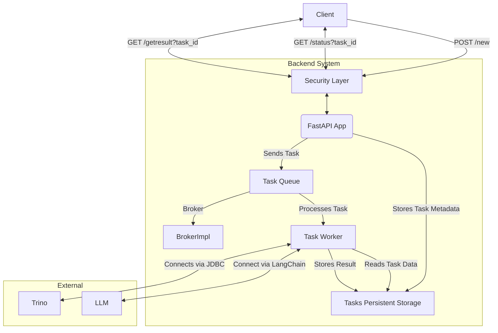

## Architecture
Below is a [**Mermaid** diagram](https://mermaid.live/edit#pako:eNplkn-PmjAYx9_Kk_61JeqAEwWybBFQc8td5p0mSyZm6eQ5JUJL2nK7m_jer1AdXgYJ-Zbn831-tD2SLU-RBGQnaLmHVZww0M9kHeUZMrWBfv9Lvfi-XMEnhn9qCD_MqFSTxS1MyvLjGYbPmoJ6PtWUVFRV8qui8vArS7WhIa45g-1QCZRVrq7IhBkubIsuFdcErHQY7lHRlCpaQ7RufkhYoJCZVLpFaEC6w807M7LUeGuIWws8VFhdoLiFQsEPKGqYro26Lcr8HbAQfItS4iXTzGT6wYWmz6T5zlr-Eem5KsSm2-toxBnDrZLwnFH4FodRDfP13d395ho6T_3Y7k2bwLwNIavf5pRCuj3oAWH5qnegMMF29k5GnYw7Oe3kzEid5r_00xeFgtG8g-f_YNLTNyVLSaBEhT1SoChosyTHBkmI2mOBCQm0TPGJ6iESkrCTtpWU_eS8uDgFr3Z7EjzRXOpVVerjxTijuoMO0fVQRLxiigRum4EER_JCgr7jDKyh642t8dj2hq5jj3rkVUOjgX9j2bY_GjuO6_ujU4_8bYtaA89zb3zb823Lckbu0D-9AdHN5Ys) that illustrates the architecture of the backend app.



### Explanation of Components and Flow
1. **Client**: Sends HTTP requests to the FastAPI app:
    - `POST /new`: Submits DDL, queries, and JDBC URL; receives a `taskid`.
    - `GET /status?task_id`: Checks task status (`RUNNING`, `DONE`, `FAILED`).
    - `GET /getresult?task_id`: Retrieves results (new DDL, migrations, updated queries).
2. **FastAPI App**: Handles REST endpoints, validates requests using Pydantic models, and interacts with the SQLite database for task metadata.
3. **Task Persistent Storage**: Stores task metadata (task ID, status, result as JSON).  _SQLite_ has been chosen for the current implementation.
4. **Task Queue**: Manages asynchronous task execution. _Celery_ has been chosen for the current implementation.
5. **BrokerImpl**:  The broker implementation that would act as the Celery broker and result backend, queuing tasks and storing task results.  _Celery_ supports both in-memory and Redis as the message broker.
6. **Task Worker**: Processes tasks in the background, connects to the external database via JDBC to analyze DDL/queries, generates new DDL/migrations/updated queries, and updates the _Task Persistent Storage_.
7. **External**: External systems (Trino, LLMs, etc,  not managed by the app).

### Flow
- A client sends a `POST /new` request with DDL, queries, and JDBC URL.
- FastAPI stores a new task in the _Task Persistent Storage_ with status `RUNNING` and sends the task to the _Task Queue_.
- The _Task worker_ processes the task, connects to the external systems, generates results, and updates _Task Persistent Storage_ with status `DONE` or `FAILED` and the result.
- The client polls `/status` to check progress and `/getresult` to retrieve the final output when done.

### Development & Local Execution

1.a Run the server and celery worker and redis (for celery). Execute command in separate command cline tabs.
Ensure that the docker is running on your machine and redis image is pulled.
```shell
make redis_start
make app_start
make celery_worker_start
```
1.b Alternatively the app could run as a Docker container. Build the image (it's optional step): 
```shell
make dbuild
```
Adjust the [docker-compose.yaml](./docker-compose.yaml) file accordingly and execute

```shell
make dcup
```

2. Submit a task
```shell
make new_rq                                                           
```
The response should look similar to 
```shell
{"taskid":"9d8edbee-5f4a-4259-bd5e-151dfa9d7742"}%
```
3. Copy the `taskid` value and pass it into the `poll_status` command, like
```shell
make poll_status TASK_ID=9d8edbee-5f4a-4259-bd5e-151dfa9d7742
```
The response should look similar to
```shell
Status: RUNNING
Status: RUNNING
Status: COMPLETE
Task is COMPLETE!
```

4. To get task details execute `getresult`
```shell
make getresult TASK_ID=9d8edbee-5f4a-4259-bd5e-151dfa9d7742    
```
For successfully completed task, the result should look similar to 
```shell
{"taskid":"9d8edbee-5f4a-4259-bd5e-151dfa9d7742","status":"COMPLETE","result":{"ok":true,"meta":{"tokens_used":0}}}%
```

## Misc
### sqlalchemy uuid for sqlite
`from sqlalchemy.dialects.sqlite import UUID` ❌
https://gist.github.com/gmolveau/7caeeefe637679005a7bb9ae1b5e421e
